## _Biz Kimiz?_

Server ÇETİN: (YTÜ İstatistik Hazırlık, İGÜ Bilgisayar  Programcılığı Mezun) [LinkedIn](https://www.linkedin.com/in/servercetin/), [Github](https://github.com/ServerCetin)

Onur YILMAZ: (İGÜ Elektronik Mezun)

Oğuzhan ÖKSÜZ: (YTÜ Makine Mühendisliği Hazırlık)

Mehmet Sait KARLIDAĞ: (YTÜ İstatistik Hazırlık)

## _Sunumuzun Bağlantısı:_

/materyaller/Sunu/sunu.pptx

## _Mobil Uygulamamızın Yolu:_

/app

## _Uygulamamızın Kısa Bilgilendirmesi:_

Uygulamayı flutter çerçevesinde yazıldı. Sadece prototip için geliştirildi. Tüm özellikleri ve fonksiyonları barındırmamakta. Uygulama içi resimleri, apk ve kaynak kodları app dosyası içerisinde görebilirsiniz.

## _Proje Şablonu_

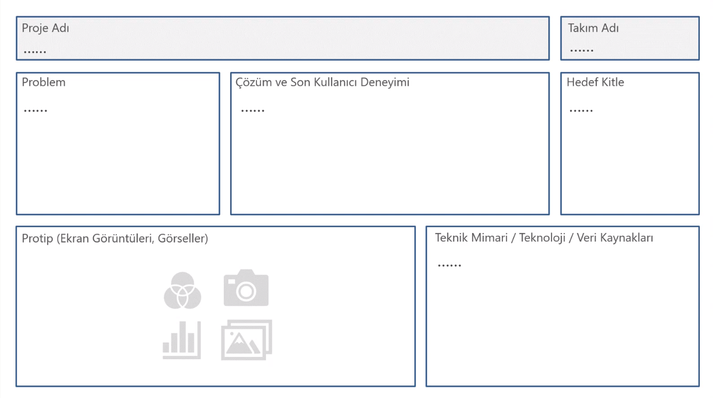

## _Daha Ayrıntılı Portfolyo_

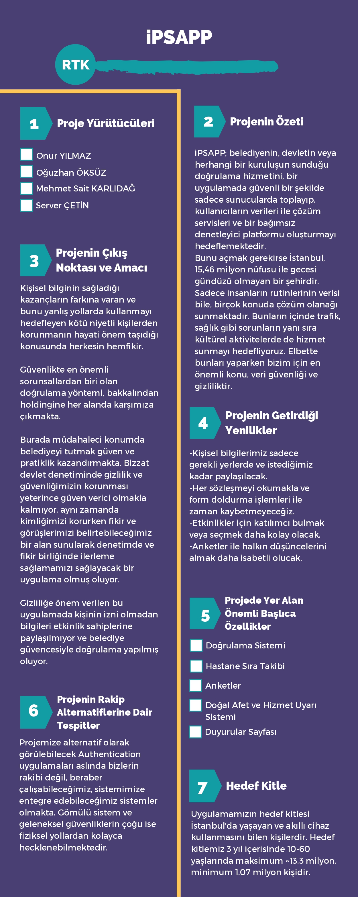
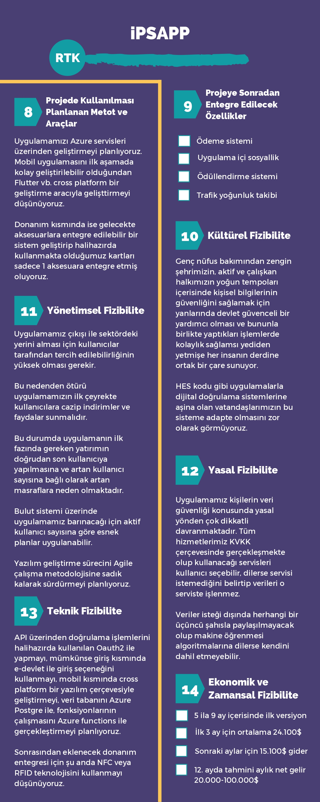

## _Ayrıntılı Senaryo_

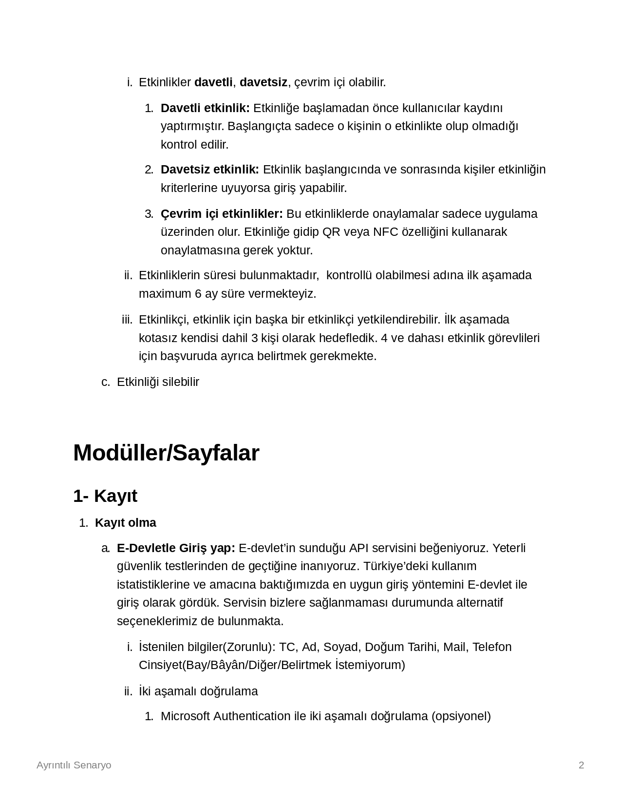
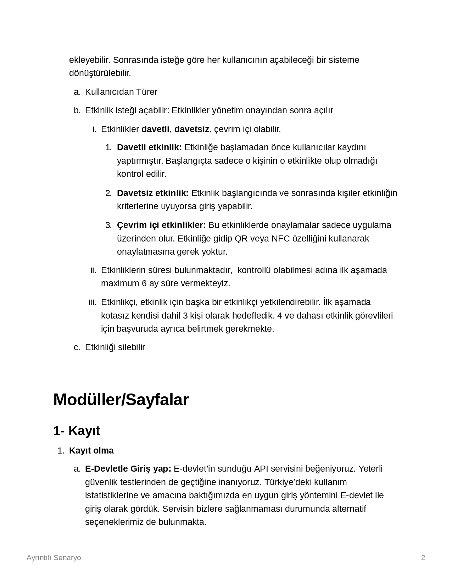
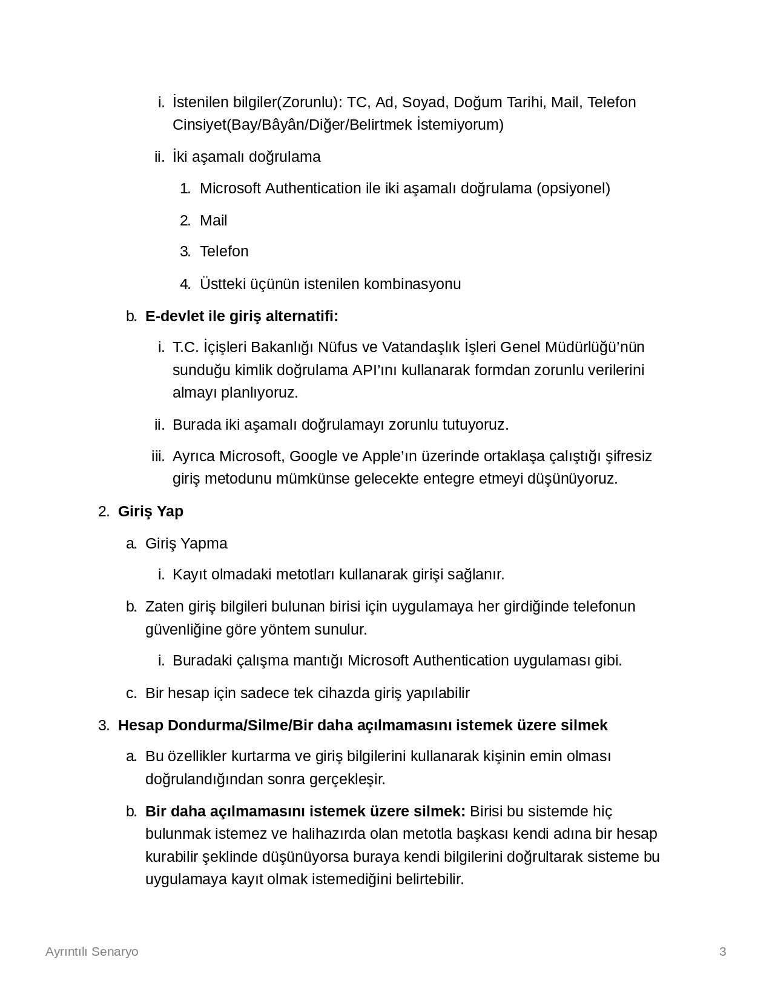
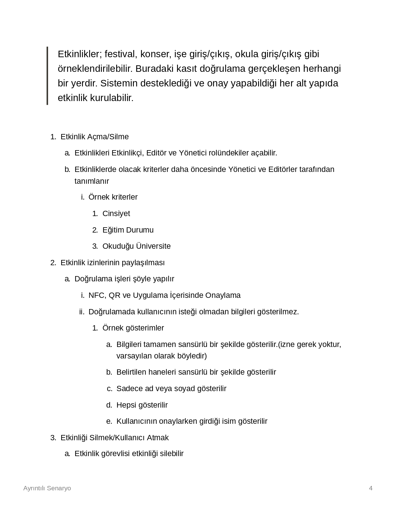
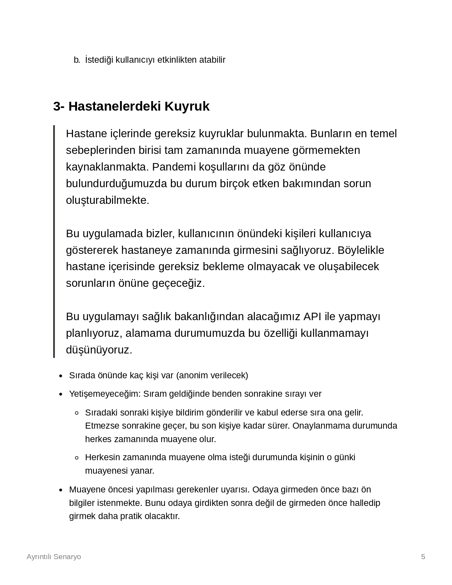
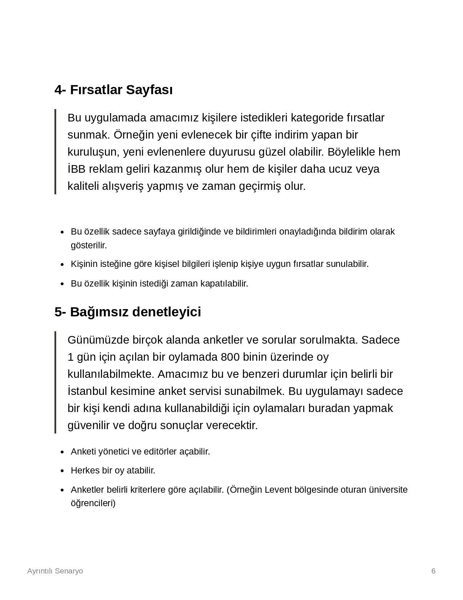
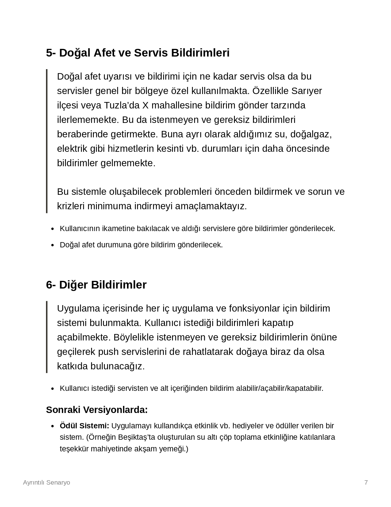
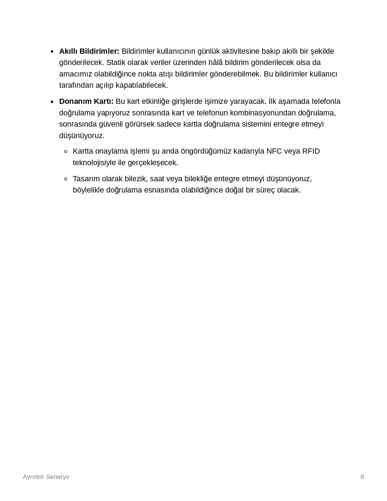

## _Kullandığımız Kaynaklar_

https://www.notion.so/
https://teams.microsoft.com/
https://ml.azure.com/
https://data.tuik.gov.tr/Search/Search?text=istanbul
https://webrazzi.com/2017/07/17/uygulama-programlama-arayuzu-api/ 
https://kamu.turkiye.gov.tr/index?page=hizmet-listesi-g2g
https://data.ibb.gov.tr/dataset/istanbul-yillara-gore-nufus-projeksiyonu-verisi
https://biruni.tuik.gov.tr/medas/
https://data.ibb.gov.tr/dataset/belediye-nufuslari-veri-seti/resource/c6c9b289-2824-41b3-ab3d-4fd655ed4e24
https://cbddo.gov.tr/
https://www.cumhuriyet.com.tr/haber/istanbulda-35-binden-fazla-ogretmen-acigi-var-88050#:~:text=
https://www.researchgate.net/publication/289994912_DESIGN_AND_IMPLEMENTATION_OF_AN_ARCHITECTURE_FOR_DATA_LEAK_PREVENTION_IN_DATA_CONTAINING_SPECIFIC_MEANING 
https://data.ibb.gov.tr/dataset/evde-saglik-hizmetleri/resource/f544fba4-ecd7-402b-b7ed-3d30b2297c00
https://data.ibb.gov.tr/dataset/istanbul-saglik-kurum-ve-kuruluslari-verisi/resource/f2154883-68e3-41dc-b2be-a6c2eb721c9e 
https://rapor.saglik.gov.tr/istatistik/rapor/ 
https://www.memurlar.net/common/news/documents/743111/4c29aaee0f2c46ea9b0bc8a286c7ce08.pdf 
Istanbul_Kart_Adedi.xlsx
Ulasim_Disi_Odemelerde_Istanbulkart.xlsx
Istanbulkart_Yukleme_Noktaları_Ulasim_Disi_Odeme.xlsx
2021-22-Etkinlik_Onay.xlsx
https://data.ibb.gov.tr/dataset/gerceklestirilen-kulturel-etkinlik-tur-ve-sayilari
https://data.ibb.gov.tr/dataset/kutuphane-ve-muzeler-mudurlugu-okuyucu-istatistikleri
https://twitter.com/profdemirtas/status/1381197600871739394
https://data.ibb.gov.tr/dataset/hava-kalitesi-istasyon-bilgileri-web-servisi
https://data.ibb.gov.tr/dataset/hava-kalitesi-istasyon-olcum-sonuclari-web-servisi
https://data.ibb.gov.tr/dataset/deprem-senaryosu-analiz-sonuclari
https://data.ibb.gov.tr/dataset/deprem-farkindalik-ve-guvenli-yasam-egitimi-alan-kisi-sayisi
https://www.seismicportal.eu/fdsn-wsevent.html
https://data.ibb.gov.tr/dataset/sismik-portal/resource/5549024c-ef61-415c-97c6-f20f47d8a138
https://data.ibb.gov.tr/dataset/100-bin-kisiye-dusen-yangin-sayisi
https://data.ibb.gov.tr/dataset/gerceklestirilen-kulturel-etkinlik-tur-ve-sayilari
https://data.ibb.gov.tr/dataset/ortalama-varis-suresi
https://data.ibb.gov.tr/dataset/itfai-istatistikler
https://data.ibb.gov.tr/dataset/itfai-istatistikler-yangin
https://data.ibb.gov.tr/dataset/itfai-istatistikler
https://www.iski.istanbul/web/tr-TR/ariza-kesinti
https://twitter.com/profdemirtas/status/1381197600871739394
https://www.memurlar.net/common/news/documents/743111/4c29aaee0f2c46ea9b0bc8a286c7ce08.pdf