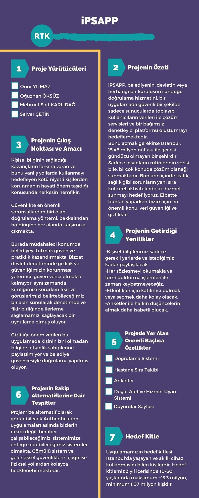

# surdurulebilir_sehir

## _Biz Kimiz?_

Server ÇETİN: (YTÜ İstatistik Hazırlık, İGÜ Bilgisayar  Programcılığı Mezun) [LinkedIn](https://www.linkedin.com/in/servercetin/), [Github](https://github.com/ServerCetin)

Onur YILMAZ...

Oğuzhan ÖKSÜZ...

Mehmet Sait KARLIDAĞ...

## _Sunumuzun Bağlantısı:_

...

## _Mobil Uygulamamızın Yolu:_

...

## _Uygulamamızın Kısa Bilgilendirmesi:_

...

## _Diğer Klasör ve Dosyaların Kısa Açıklaması:_

...

## _Proje Şablonu_

## _Daha Ayrıntılı Portfolyo_

## _Ayrıntılı Senaryo_

## _Kullandığımız Kaynaklar_